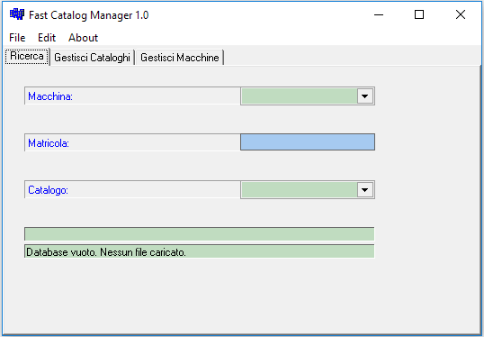

# Fast Catalog Manager

Standalone database application for managing catalogs.

Last updated on 2004-02-27 and implemented in Borland C++ Builder 6.0.

Binaries for Windows OS (32bit) are included and the software works within recent OS.

## Screenshots

