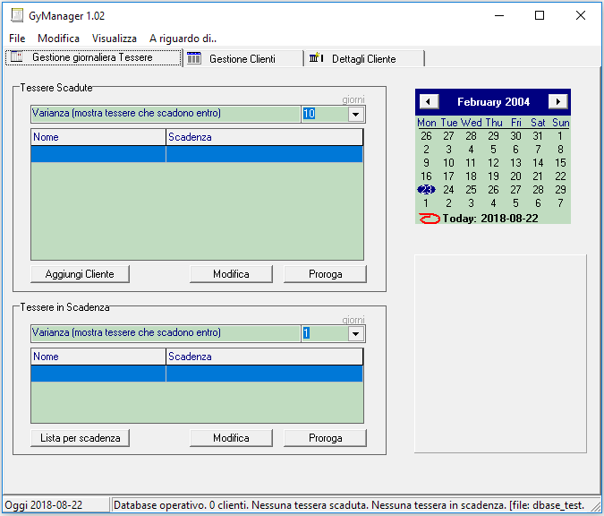
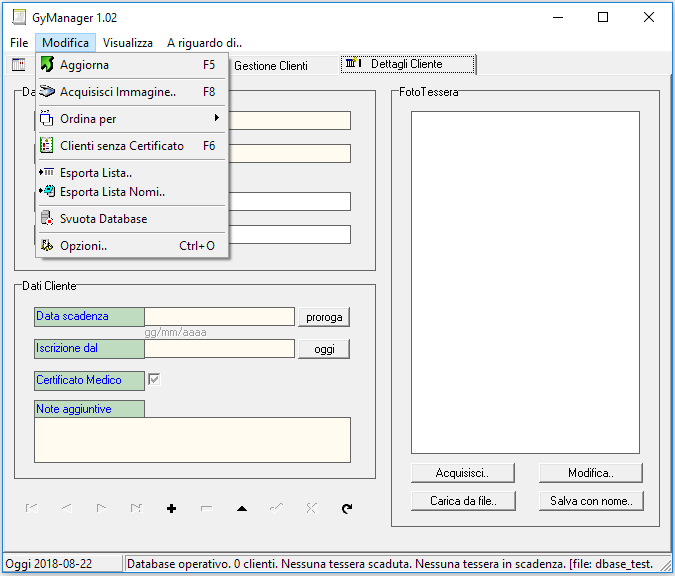

# GyManager

Standalone database application for managing clients of a Gym.

Last updated on 2004-04-09 and implemented in Borland C++ Builder 6.0, DB engine uses BDE drivers (DBase).

Binaries for Windows OS (32bit) are included and the software works within recent OS.

## Features
* DB/Tables Editing. 
* Save Images in the Database
* Uses TWAIN Dlls for acquiring images.

## Screenshots

